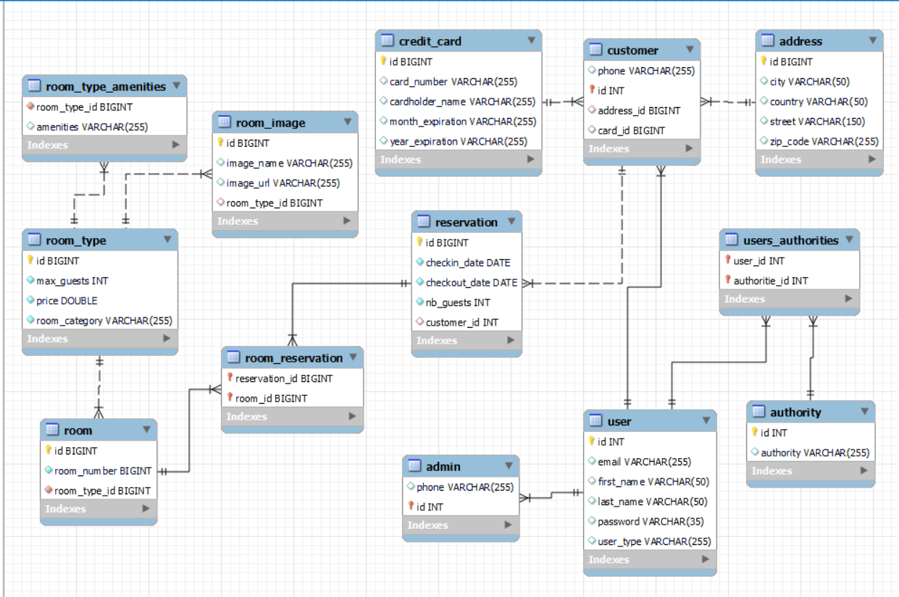

# Voyaging

## About the Project

Voyaging is a  Java-based web application that enables users to book hotel rooms.
- Users can search for available rooms based on their check-in and check-out dates, the number of guests, and the number of rooms.
- The application displays a list of available rooms that match the user's search criteria.
- Calculates and displays accommodation charges
- After a booking is confirmed, the application sends an email confirmation to the user's specified contact details.
- The application provides an admin interface that allows hotel managers to manage rooms( add, update, or delete room), and view booking history.

## Built with

- Core Java
- MySQL
- Spring Framework :
  - Spring MVC
  - Spring Boot
  - Spring Security
  - Spring Data JPA
  - Spring Email;
  - Spring Validator
- Thymeleaf
- HTML
- CSS
- Bootstrap
- JavaScrip

## Database Schema

